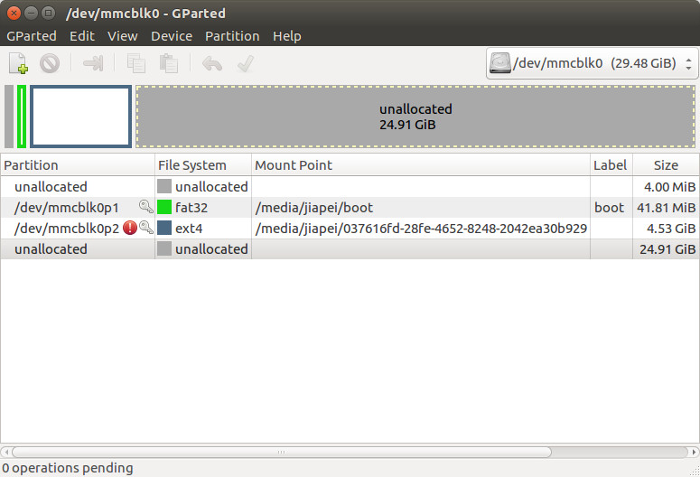

# 1.3 Install Raspbian onto Raspberry Pi

The version that we are using when writing **Raspberry Pi Full Stack** is [Raspbian Stretch](https://www.raspberrypi.org/downloads/raspbian/), which is release on August 16, 2017.

Details about how to install Raspbian onto a Raspberry Pi can be found on its official website:[https://www.raspberrypi.org/documentation/installation/installing-images/linux.md](https://www.raspberrypi.org/documentation/installation/installing-images/linux.md).


In short, **ONLY** one command will do the installation on a SD/TF card:

```
sudo dd bs=4M if=2017-08-16-raspbian-stretch.img of=/dev/mmcblk0 status=progress conv=fsync
```

After the installation, you will see the SD/TF card is formated as in the following image (here, we use [GParted](http://gparted.org/) as the partition tool):

There are 4 partitions in total:
1. unallocated 4.00 MiB -- leave **UNUSED**
2. /dev/mmcblk0p1 fat32 41.81 MiB
3. /dev/mmcblk0p2 ext4 4.53 GiB
4. unallocated 24.91 GiB -- to be **USED**

To make **FULL** use of the SD/TF card's storage, traditionally, you need to manually resize/enlarge **/dev/mmcblk0p2** to cover the 2nd unallocated storage 24.91G. Ever since [Raspbian Stretch](https://www.raspberrypi.org/downloads/raspbian/), you can plug out the SD/TF card directly and try to reboot your Raspberry Pi 3B without manually changing anything. Raspbian's **FIRST** booting will **automatically** resize/enlarge **/dev/mmcblk0p2** to cover the entire 2nd unallocated storage 24.91G.

Now, we can plug the SD/TF card out from the PC and plug it into the Raspberry Pi 3B and boot it as follows:


Before starting playing with Raspbian on Raspberry Pi, there are still two more steps to go:
* raspi-config
* Enable the Internet