# 1.4 Raspberry Pi Configuration


## 1.4.1 raspi-config
[**raspi-config**](https://www.raspberrypi.org/documentation/configuration/raspi-config.md) is the Raspberry Pi configuration tool specifically for the Raspberry Pi.
Command
```
sudo raspi-config
```
will pop up the following configuration page:

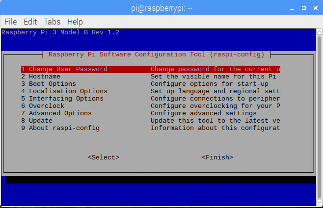

There are 9 items in total, and four of them, are to be configured:
* 4 Localisation Options: Set up language and regional settings
* 5 Interfacing Options: Configure connections to periphery devices
* 7 Advanced Options: Configure advanced settings
* 8 Update: Update this tool to the latest vesion firmware


## 1.4.2 Localisation Configuration
After having selected **4 Localisation Options**, you will be able to see the following page:

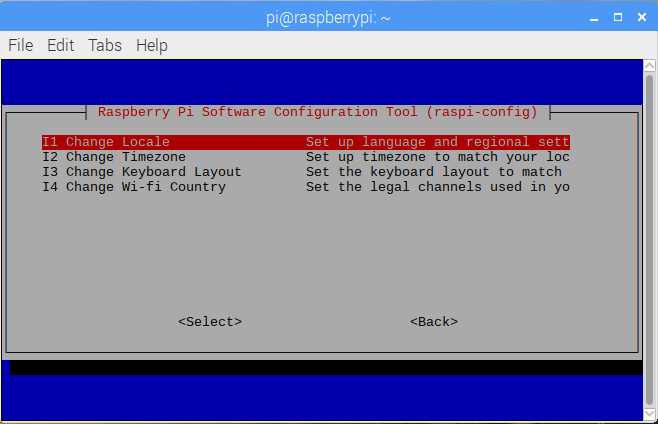

From **NOW** on, we are going to change **Locale**, **Timezone**, **Keyboard Layout**, as well as **Wi-fi Country** one by one.


* **Locales**

**en_GB.UTF-8 UTF-8** is enabled as the default locales settings:

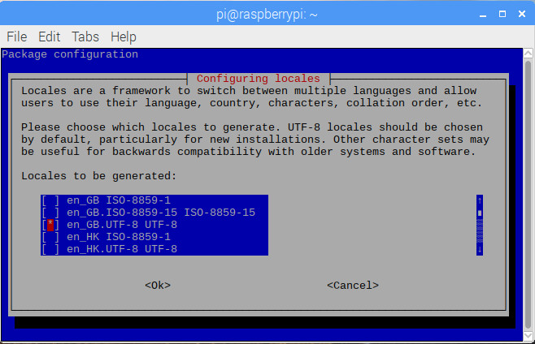

Since the author is at Vancouver, Canada, North America, while writing [Raspberry Pi Full Stack](https://longervision.gitbooks.io/raspberry-pi-full-stack), we need to make sure  **en\_US.UTF-8 UTF-8** is enabled, to take the place of **en\_GB.UTF-8 UTF-8**, which is supposed to be ticked **OFF** instead.

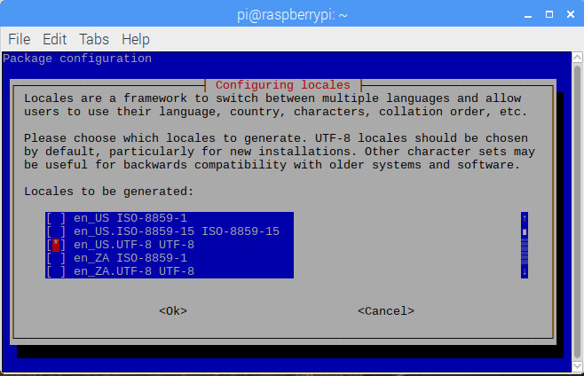

After selecting **OK**, the following page is popped up:

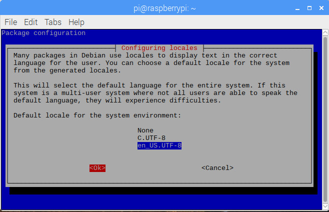

Then, press **OK** again, and we fill finish the system locale settings.


* **TimeZone**

Users should set their own TimeZone. In our case, **America** and **Vancouver** are respectively seletect as the **Geographic area** and **Time zone**, as follows:

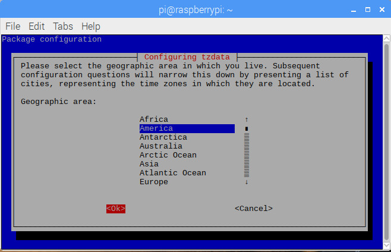

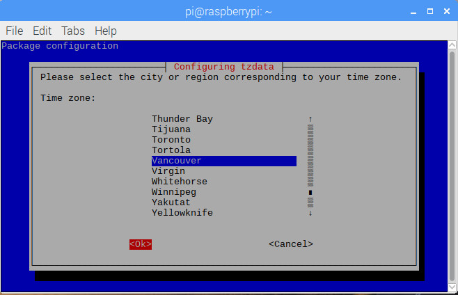

Then, press **OK** again, and we will finish the system timezone settings.


* **Keyboard Layout**

A correct Keyboard Layout also needs to be correctly configured. Specifically for the author's keyboard, five selections are respectively chosen as:


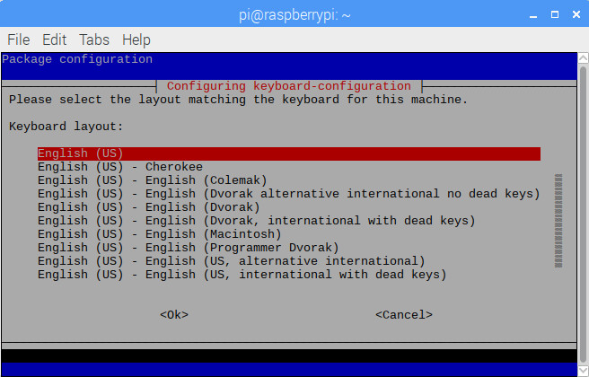


Then, press **OK** again, and we fill finish the system keyboard layout settings.

* **Wi-fi Country**

Afterwards, users are expected to select their own wi-fi country. Here, **Canada** is selected as the author's wi-fi country.

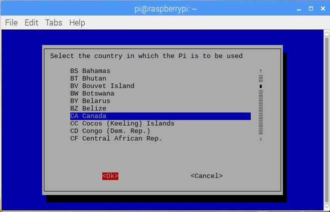

Then, press **OK** again, and we fill finish the wi-fi country settings.


<!-- **dpkg-reconfigure** is to reconfigure an already installed package. **dpkg-reconfigure** is **NOT** specific for Raspberry Pi.

* **dpkg-reconfigure tzdata**: **tzdata** refers to **time zone data**.
* **dpkg-reconfigure locales**: **locales** is for localization and language configuration.
* **dpkg-reconfigure keyboard-configuration**: clearly, **keyboard-configuration** is for keyboard configuration. -->


## 1.4.3 Interface Configuration

Users can enable their needed interfaces after selecting **5 Interfacing Options**. Here on our courses, students are encouraged to enable **ALL** 8 interfaces listed as follows:

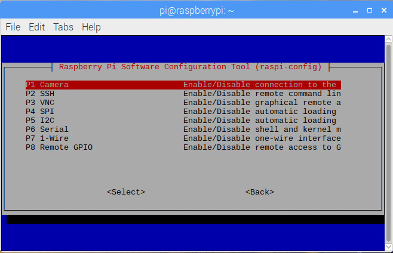


## 1.4.4 Advanced Settings

By selecting **7 Advanced Options**, the following page is shown.

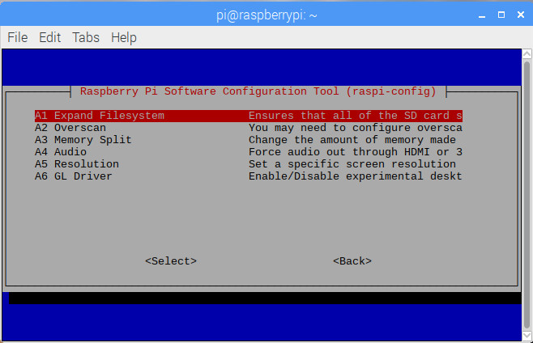
 
**A1 Expand Filesystem** is just exactly what has happened during **FIRST** booting, in order to make full use of all SD/TF storage. By selecting **A1 Expand Filesystem**, you will see the following page.


## 1.4.5 Firmware Updating

**8 Update** is used to update the tool **raspi-config**.


Now, rebooting the system. In the [next section](./05_network_configuration.md), Internet is going to be enabled.