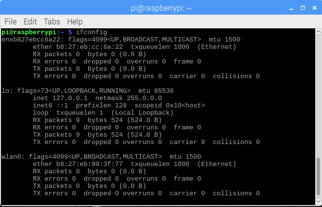
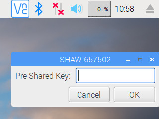
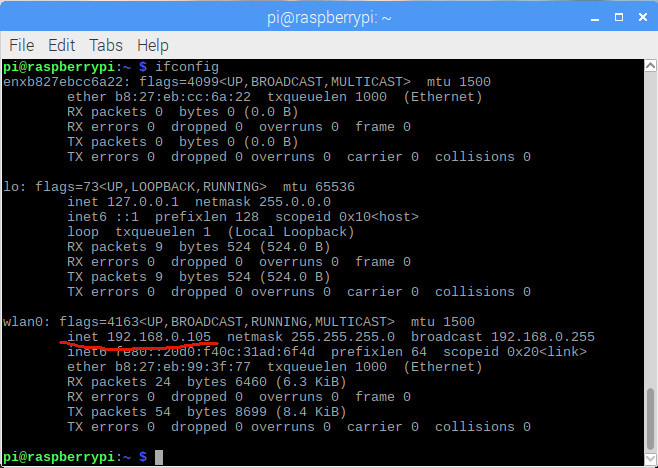
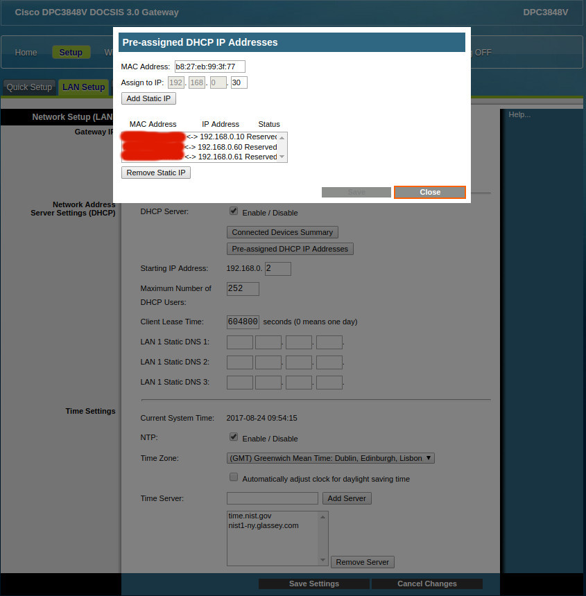
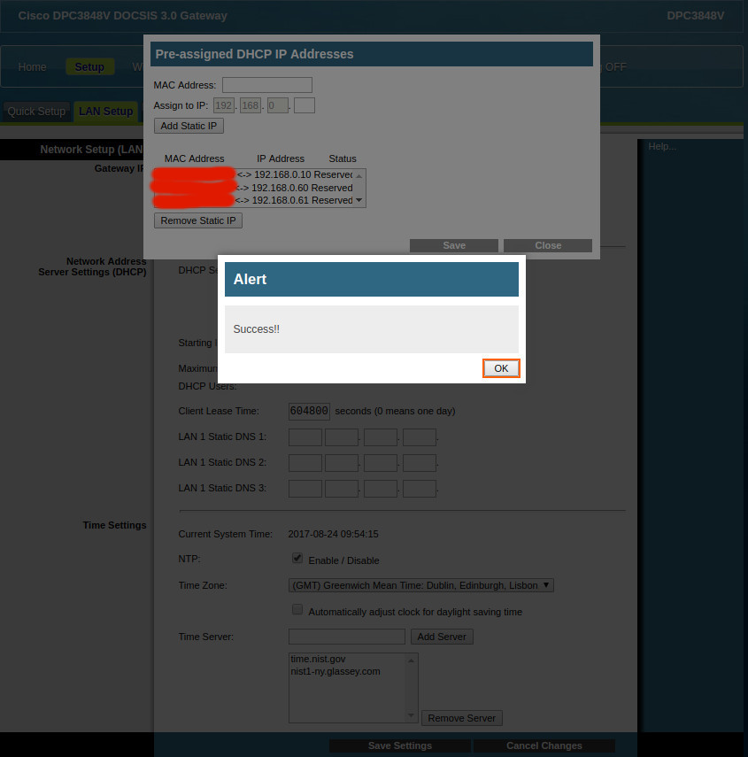
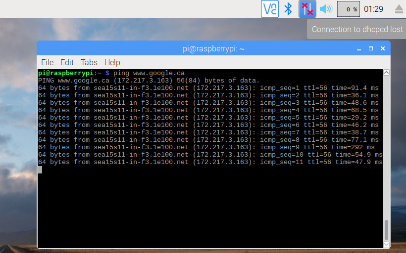

# 1.5 Network Configuration

So far, we are **NOT** able to surf the Internet yet. In this chapter, we are going to enable our Internet by configuring network settings, and then set up a static IP address for your Raspberry Pi.

## 1.5.1 Connect to Internet
Command
```
ifconfig
```
shows the current network configuration.



Obviously, there is **NO** Internet yet, as indicated on the top-right corner.


And, by clicking on the **Wifi** icon, it will open a list of detected **Wifi** networks:


You will notice that Raspberry Pi 3B **ONLY** detects the 2.4G Wifi network, which can be confirmed from its [official specification](https://www.raspberrypi.org/products/raspberry-pi-3-model-b/). Clearly, [BCM43438](http://www.cypress.com/file/298076/download) is the chip with 
> a 2.4 GHz WLAN IEEE 802.11 b/g/n MAC/baseband/radio, Bluetooth 4.1 support, and an FM receiver.

Click on your network, the **Pre Shared Key** dialog will be popped up for you to input the password, as follows:



After inputing the correct password to your **Wifi**, you will see the Internet is NOW connected:


Move your mouse to the **Wifi** icon, you will see the network information about **wlan0**.


Now, let's have a look at the network configuration by command
```
ifconfig
```
again.



As you can see, the IP address is NOW automatically allocated as **192.168.0.105**.


## 1.5.2 Set Static IP (Optional but Strongly Recommended)

In order to be more easily and accurately locate which device is of which IP address, without shifting to a **NEW** IP address while reconnecting to the **SAME** network, users would like to set static IPs for frequently-used devices.

There are at least three ways to set up a static IP for Raspberry Pi 3B.

**I. Router**

Specifically for ther author's Cisco router, there is a place to specify **Pre-assigned DHCP IP Address**.


After this **Pre-assigned DHCP IP Address** dialog is opened, we **Add Static IP**, then **Save**. Finally, we will be able to see the **Success** dialog.






After the static IP configuration from within the router, we reconnect(disconnect first and then connect again) Raspberry Pi 3B to Internet, we'll be able to see the IP address has already changed accordingly.

However, to think of one additional issue? If the router is rebooted for some reason, all pre-assigned IP will be forgot by the router, what are you going to do?

Yes. The answer is: do some configuration on the Raspberry Pi 3B, instead of router.


**II. Configure /etc/dhcpcd.conf**

Refer to **ModMyPi** online blog [How to give your Raspberry Pi a Static IP Address - UPDATE](https://www.modmypi.com/blog/how-to-give-your-raspberry-pi-a-static-ip-address-update)

**/etc/dhcpcd.conf** is supposed to be configured as:
```
interface eth0
static ip_address=192.168.0.31/24
static routers=192.168.0.1
static domain_name_servers=192.168.0.1 8.8.8.8

interface wlan0
static ip_address=192.168.0.30/24
static routers=192.168.0.1
static domain_name_servers=192.168.0.1 8.8.8.8
```


**III. Configure /etc/network/interfaces and /etc/wpa\_supplicant/wpa\_supplicant.conf**

Refer to **ModMyPi** online tutorial [Tutorial - How to give your Raspberry Pi a Static IP Address](https://www.modmypi.com/blog/tutorial-how-to-give-your-raspberry-pi-a-static-ip-address)

For **/etc/network/interfaces**, the following snippet of code is to be added at the bottom:
```
auto eth0
iface eth0 inet static
    address 192.168.0.31
    netmask 255.255.255.0
    gateway 192.168.0.1

allow-hotplug wlan0
iface wlan0 inet static
    address 192.168.0.30
    netmask 255.255.255.0
    gateway 192.168.0.1
wpa-conf /etc/wpa_supplicant/wpa_supplicant.conf
```

For **/etc/wpa\_supplicant/wpa\_supplicant.conf**, the default network is needed to configure as follows:
```
ctrl_interface=DIR=/var/run/wpa_supplicant GROUP=netdev
update_config=1
country=CA

network={
    ssid="Wifi Network SSID"
    psk="Password Phrase"
    key_mgmt=WPA-PSK
}
```
respectively.

A lot more discussion can be found in Raspberry Pi Official Forum, topic title 
[Raspberry Pi 3 Wifi Static IP](https://www.raspberrypi.org/forums/viewtopic.php?f=91&t=157250).

Here in our case, **/etc/network/interfaces** and **/etc/wpa\_supplicant/wpa\_supplicant.conf** are modified accordingly, while **/etc/dhcpcd.conf** is left as it is.


After the network is configured, ```ifconfig``` brings a **NEW** IP address: **192.168.0.30**.


**What's WEIRD**

**Two weird things** are:
1. If **/etc/dhcpcd.conf** is configured, **Raspberry Pi 3B** with **Raspbian Stretch** **CANNOT** connect to the Internet any longer.

2. If **/etc/network/interfaces** and **/etc/wpa\_supplicant/wpa\_supplicant.conf** are configured, **Raspberry Pi 3B** with **Raspbian Stretch** is **ABLE** to connect to the Internet, but with the top right corner **Wifi sign** as **Unconnected** or **Disconnected**:


