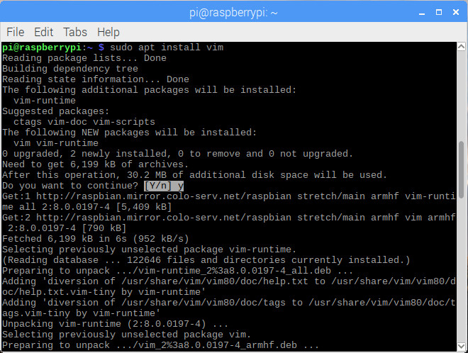
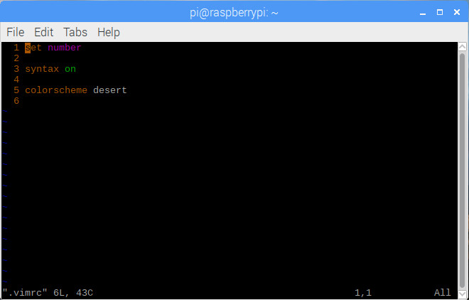
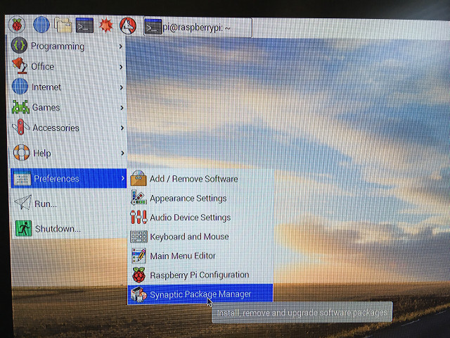
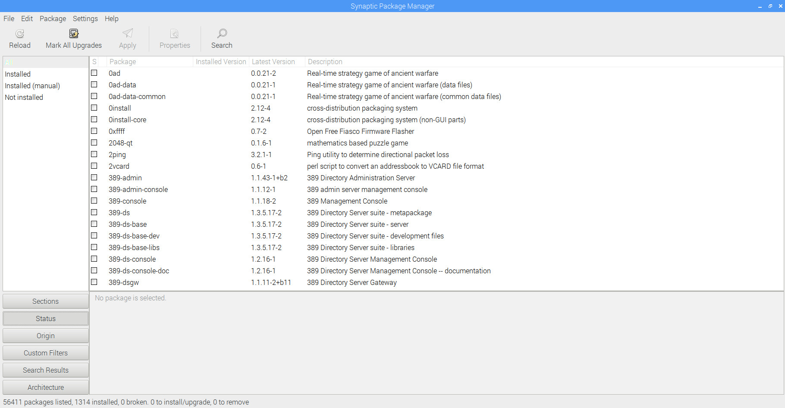
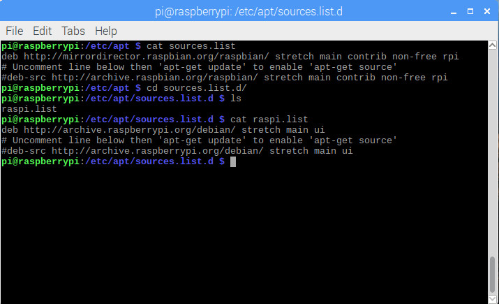

# 2.1 Package and Repository Management

We **FIRST** install some recommended packages, such as, **vim**, **synaptic**, etc.

## 2.1.1 Commands for Package Management

* ```sudo apt install packagename```: for **FIRST** time installation
* ```sudo apt upgrade packagename```: for upgrading an already-installed package
* ```sudo apt remove packagename```: for uninstalling an already-installed package

## 2.1.2 Vim

Every Linux user might have known two popular text-mode editor: **nano** and **vi**. Functionally speaking, **vim** is a superset of **vi** but with more convenient hot keys to edit. Let's install it and test it out.

```sudo apt install vim```


After the installation, let's create a new hidden file **.vimrc** under folder **~**, which is a configuration file for **vim**.
Bash command ```vim .vimrc```, then press **i** to change into the **Insert** mode, as follows:


Then, type in the following 3 lines to enable the style whenever **vim** editor is opened, then type in **:wq** to save and quit.


Type command ```cat .vimrc``` to make sure the content has been correctly typed into the file **.vimrc**.


And finally, we can open the file **.vimrc** by **vim** again, and you will be able to see the line number in the editor by default.




Throughout [Raspberry Pi Full Stack](https://longervision.gitbooks.io/raspberry-pi-full-stack/), for text-mode editing, we use **vim** instead of **nano**.

## 2.1.3 Synaptic

Synaptic is a GUI based application to easily manage packages. We **FIRST** install it and have a look at what **Synaptic** is?

```sudo apt install synaptic```


After installation, you will see **Synaptic** is installed under system **Preferences**.



Click on **Synaptic Package Manager**, you will see the following Synaptic view.



Click on **Help** then **About**, you will be able to see the following **About Synaptic** Dialog.


## 2.1.4 Change Repositories

[**Repository**](https://en.wikipedia.org/wiki/Software_repository) is where to store system-compatible software packages. Since there are a lot of mirrors over the world, some are just inside your country, some are closer to you, and some are just down without response, so that when you download software packages,you will notice an obvious speed difference by choosing different repositories. Those reasons are **WHY** some times we prefer specifying a **STABLE** and **FASTER** repository. Often, the repository to be selected is **CLOSER** to where the Raspberry Pi is.

* By **Synaptic**
Open **Synaptic**, then click on **Settings**, you will be able to see the submenu named **Repositories**. Click on it, and you will see the current existing and ticked repository URLs.


You can of course **NEW** some repositories, which you can find by **GOOGLE**. For **NOW**, just remember what have been ticked, and compare them to the content in file **/etc/apt/sources.list** and directory **/etc/apt/sources.list.d/**.



Clearly, **Synaptic Repositories** just contains exactly the **SAME** content as in file **/etc/apt/sources.list** and the files under directory **/etc/apt/sources.list.d/**.