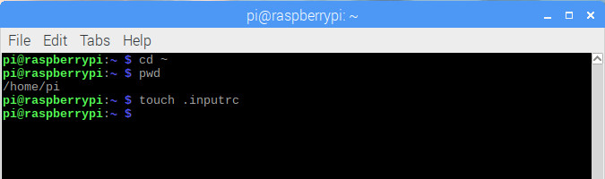
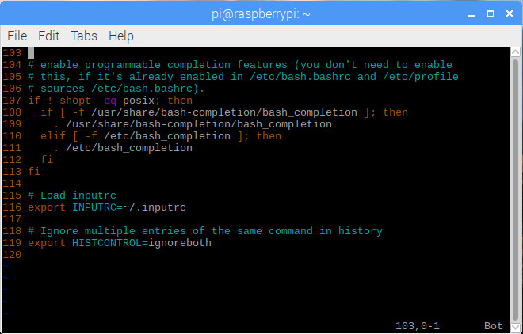

# 2.2 Matlab Like Bash

**First of all**, make sure you are under the **HOME** directory, and then create a hidden file named **.inputrc**.



Then, we modify the file **.inputrc** by **vim**.


```
# Matlab like Bash history
"\e[B": history-search-forward
"\e[A": history-search-backward

# Include system wide settings which are ignored
# by default if one has its own .inputrc
$include /etc/inputrc
```


**Afterwards**, we added the following snippet of code at the end of file **.bashrc**.

```
# Load inputrc
export INPUTRC=~/.inputrc

# Ignore multiple entries of the same command in history
export HISTCONTROL=ignoreboth
```




**Finally**, we will be able to have **Matlab like Bash**. That is to say: if we type in **ls **, and then press **&uparrow;** or **&downarrow;**, we will be able to see all **ls ** commands **ONLY**, regardless of all other previous commands.

