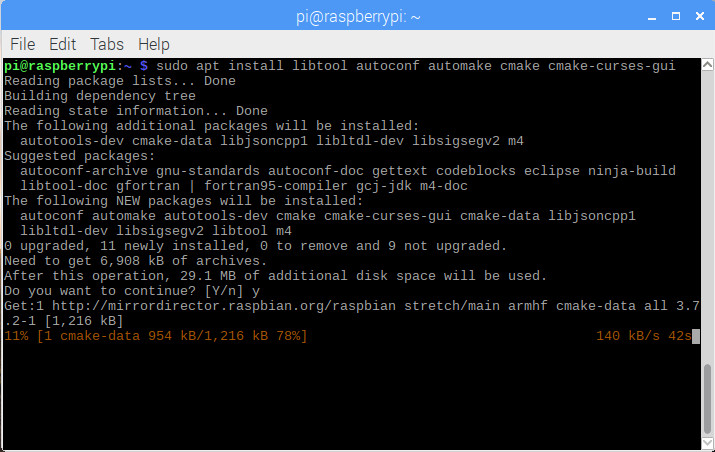
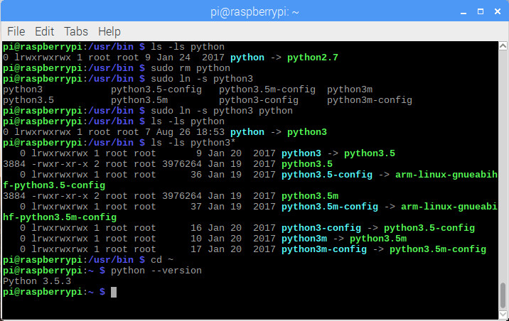
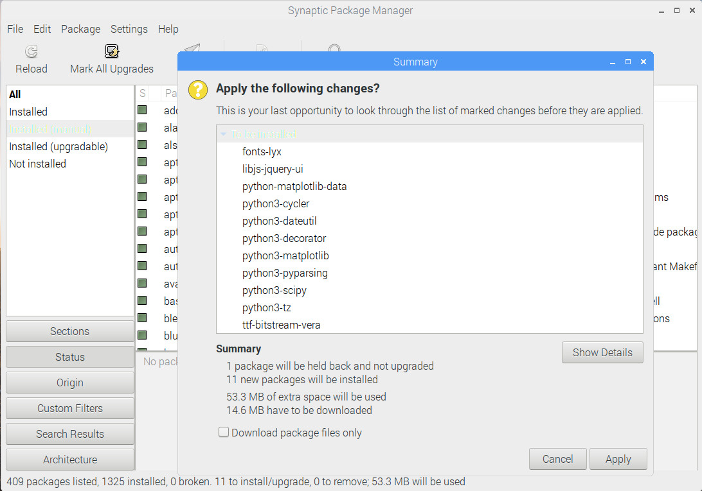

# 2.3 Install Packages from Repository

## 2.3.1 Packages About C/C++ Compilation

Some uninstalled packages about C/C++ compilation are installed in advance.

```
sudo apt install libtool autoconf automake cmake cmake-curses-gui
```




## 2.3.2 Version Control Packages

```
sudo apt install git git-core subversion
```


## 2.3.3 Some Python Packages


Default python on Raspbian is of version 2. Clearly, the symbolic link **/usr/bin/python** is linked to **/usr/bin/python2.7**. We need to manually change the symbolic link to **/usr/bin/python3**, which is another symbolic link to **/usr/bin/python3.5**. Please refer to:



Here, we are going to install some python packages, including **scipy**, **numpy**, **matplotlib**, **pandas**, **sklearn**, **skimage**, etc., via **Synaptic Package Manager**.



For some other python packages, such as: **statsmodels**, there seems to be **NO** version for **python3** yet. We are going to install such packages from source in the [next subsection](04_install_package_from_source.md).