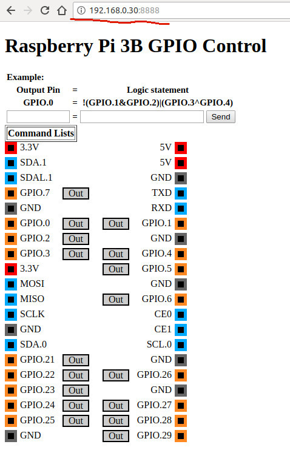

# 3.1 GPIO Web Server


[Longer Vision Robotics](http://www.longervisionrobot.com/en/index.html) provides its own code to test Raspberry Pi 3B's GPIOs. The backend server is written in **Python**, while the frontend interface is written in **javascript**.

Let's check out the source code first:
```
git clone git@github.com:LongerVision/RaspberryPi.git
```


To run this code, you will need **python3-rpi.gpio**, 
run the server from terminal with specified IP address (Raspberry Pi 3B's IP) and an randomly specified unused port number.


And then, we can interact with the server from a webbrowser by specifying Raspberry Pi 3B's IP with the specified port number, as follows:

